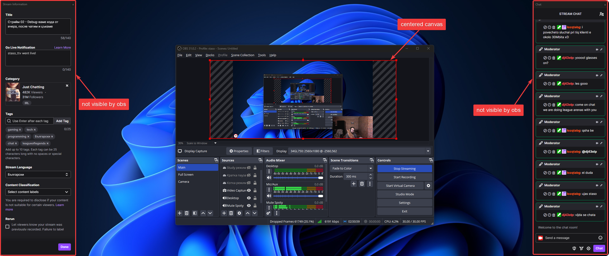

# <p align="center"><br>Window Center Application<br><a href="LICENSE"></a></p>

# Overview

This app aims to help streamers with an ultra-wide monitor setup utilize the full extent of their displays by centering the active window application. This leaves some headroom on either side of the window so that the streamer can align additional windows (see suggestions in Section TODO: add section number) to make their streaming experience more comfortable.

# 1. Application

The app has been written in Python and built using the pyinstall [library](https://pyinstaller.org/en/stable/) in conjection with the argument parameters `--onefile` and `--noconsole`. The downloadable executable can be found under the [Releases tab](https://github.com/staso-gh/center-window/releases). If the user desires, they can simply download the script and run it using a python interpreter or build it themselves from source.

To change the default hotkey used for centering the application, the user can navigate to the `hotkey.cfg` file and edit the hotkey, here are a few examples:

```yaml
# Example 1, default hotkey
hotkey = 'ctrl+alt+shift'

# Example 2
hotkey = 'ctrl+alt+o'

# Example 3
hotkey = 'alt+w'
```

To exit the application, navigate to the tray icon area and right-click on the Window Center Application, then select the 'Exit' option.

# 2. Proposed alignment of the desktop canvas inside OBS

The streamer should have their desktop canvas aligned in the center as shown in the screenshot below to achieve consistent results:

<br>

# 3. Application in action

Here is an example usage of the application:

<br>


# Requirements

- Windows 10 or 11

# Contributing

Contributions are welcome! Please feel free to submit a Pull Request.

---

<p align="center">Made with ❤️</p>